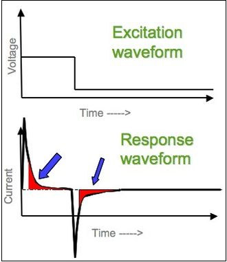
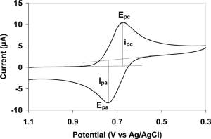
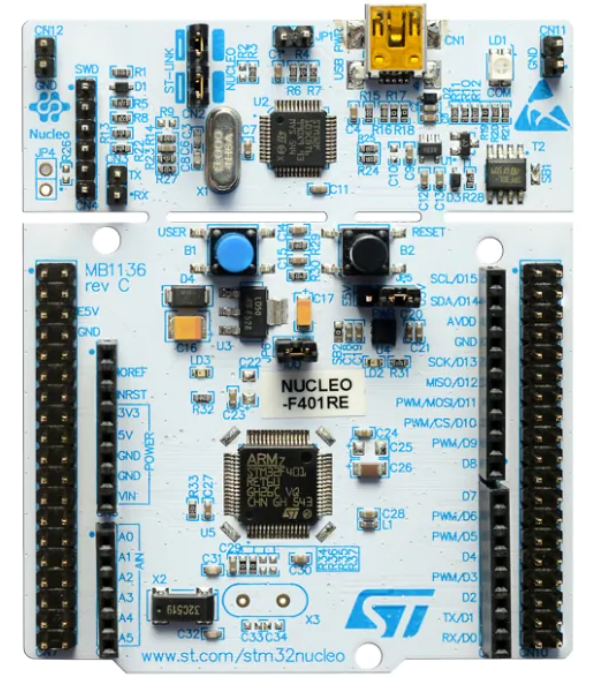
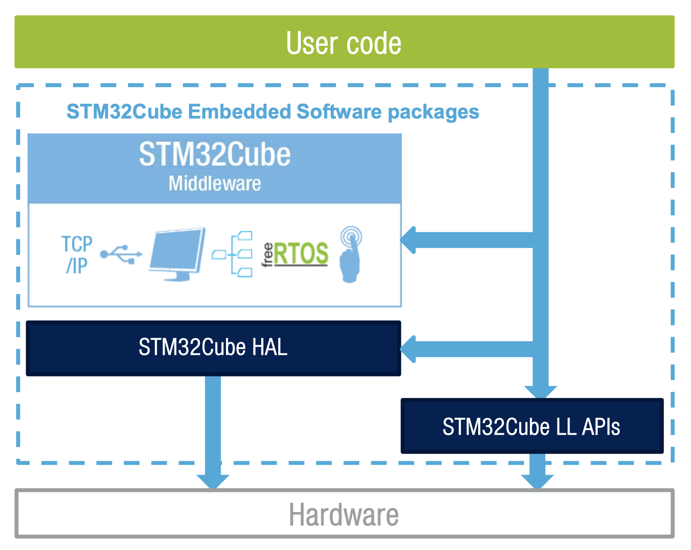
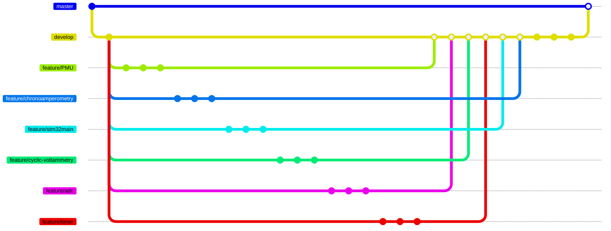
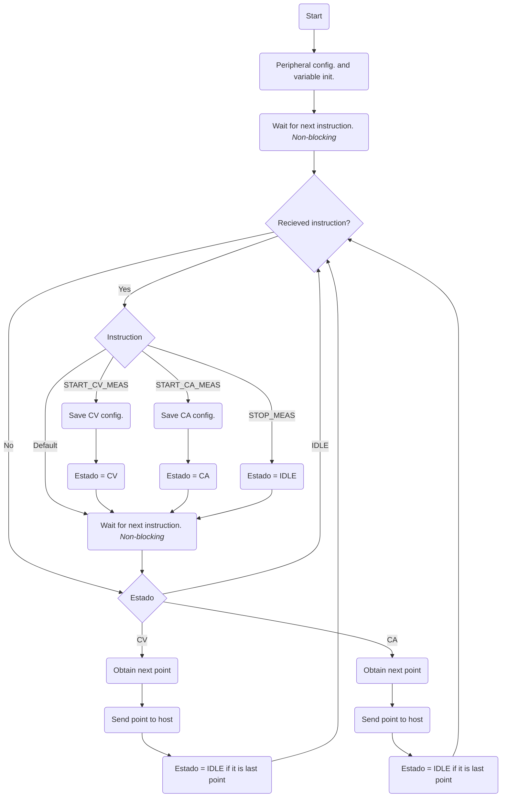
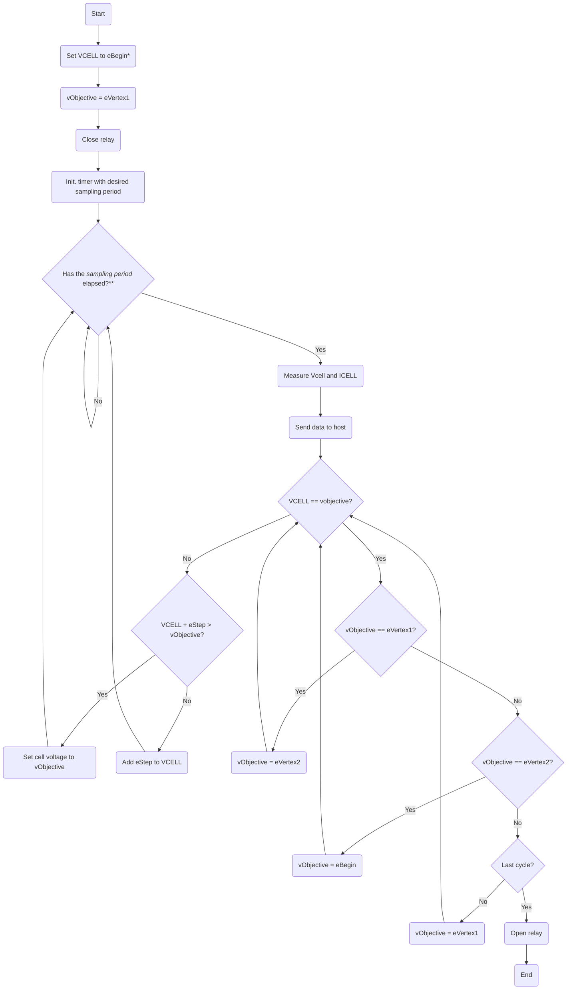
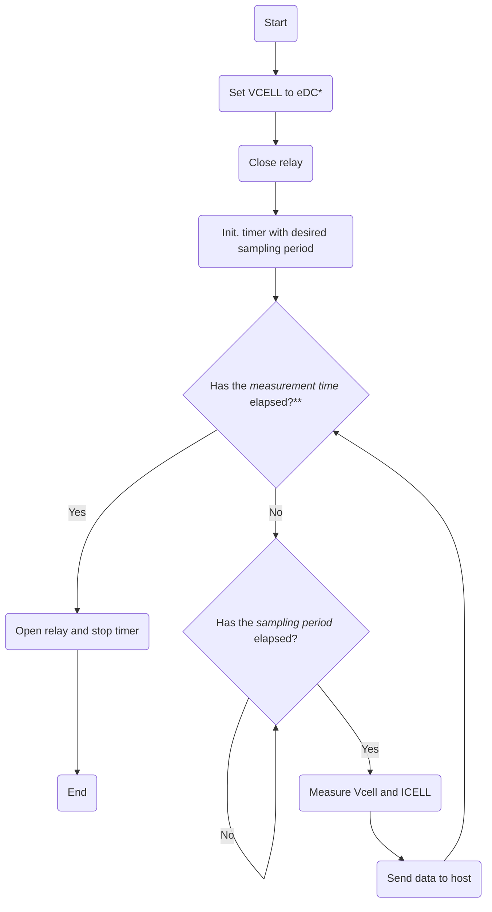
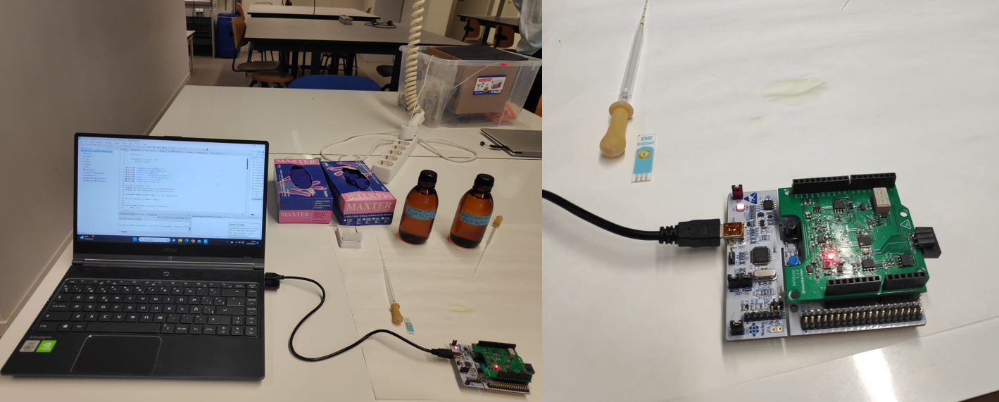
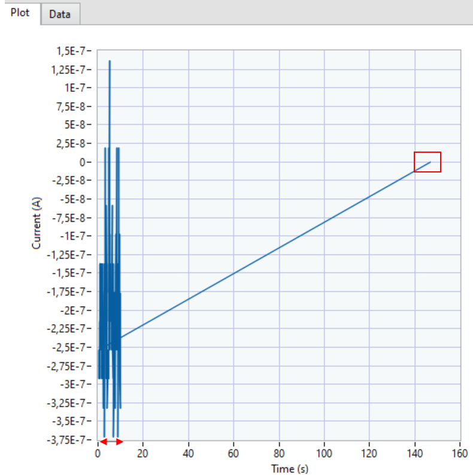

</br>

The students Álvaro Leva Ligero and Guillermo Ruiz Carmona conducted this project as part of their coursework of Microcontrollers for Biomedical Applications and Systems course for the Degree in Biomedical Engineering at the University of Barcelona (UB).

The project's aim was to create an algorithm for a microcontroller that could **control and carry out chemical tests using a potentiostat** using a set of seven instructions and a LabView-developed graphical user interface (viSens-S) for configuring various parameters. This research involves measuring several chemical solutions using chronoamperometry and cyclic voltammetry.

### Table of Contents

- [Introduction](#introduction)
   - [Potentiostat](#potentiostat)
   - [Chronoamperometry](#chronoamperometry)
   - [Cyclic voltammetry](#cyclic-voltammetry)
- [Objectives](#objectives)
- [Material and methods](#material-and-methods)
   - [STM32F401 Nucleo-64](#stm32f401-nucleo-64)
   - [STM32Cube IDE](#stm32cube-ide)
   - [Git and Github](#git-and-github)
   - [LabView](#labview)
   - [Front end modules](#front-end-modules)
- [Operation Flows](#operation-flows)
   - [App OF](#app-of)
   - [Microcontroller OF](#microcontroller-of)
   - [Cyclic-voltammetry OF](#cyclic-voltammetry-of)
   - [Chronoamperometry OF](#chronoamperometry-of)
- [Results](#results)
- [Conclusions](#conclusions)


## Introduction

The system controlled by LabView's graphical user interface enables the use of a potentiostat to perform **chronoamperometry and cyclic voltammetry** by setting various parameters.

A STM32F401 Nucleo-64 board has been designed to enable chemical testing to be carried out for use later in laboratories using C programming in the **STM32Cube environment**. A microcontroller that can receive parameters and transmit the measured data to a graphical interface shown on a computer screen serves as the project's central axis.

### Potentiostat

It is a device to manage a three-electrode cyclic voltammetry cell used to analyse analytes electrochemically.

The potentiostat's front-end pins, which communicate with the microcontroller, are as follows:

| Pin | Aliases | Type | Description |
| :-: | :---: | :------------------: | :-------------------------------------------------------------------------------------------------------------- |
| PA0 | VREF | Analog input | Absolute voltage of the _Reference Electrode (RE)_ V<sub>REF</sub> used for the measurement of V<sub>CELL</sub>. |
| PA1 | ICELL | Analog input | TIA output voltage used for I<sub>CELL</sub> measurement. |
| PB8 | SCK | I<sup>2</sup>C (SCK) | SCK signal from the I<sup>2</sup>C. With the I<sup>2</sup>C bus the DAC of the _front-end_ is controlled. |
| PB9 | SDA | I<sup>2</sup>C (SDA) | SDA signal from the I<sup>2</sup>C. With the I<sup>2</sup>C bus the DAC of the _front-end_ is controlled. |
| PA5 | EN | Digital output | PMU (dis)enable signal.<br>`0`: PMU disabled. `1`: PMU enabled. |
| PB5 | RELAYS | Digital output | Relay control signal.<br>`0`: Relay open. `1`: Relay closed. |

> Table with the pins in the [guidelines](https://github.com/Biomedical-Electronics/masbstat-arlevino_grc32) of the project.

### Chronoamperometry

**[Chronoamperometry](https://en.wikipedia.org/wiki/Chronoamperometry)** makes use of an electrode excited by a voltage potential and is able to monitor the electrochemical reactions taking place in this electrode as a time-dependent current.

<p align='center'>

</p>

<p align="center">
<i> Fig.1 - Chronoamperometry example graph . </i>
</p>

> [figure reference](https://en.wikipedia.org/wiki/Chronoamperometry)

The analyte's diffusion across the sensor's surface affects how the [current changes over time](https://pubs.acs.org/doi/abs/10.1021/jp711936y). Concentration plays a key role when considering the values that are obtained.

### Cyclic voltammetry

In a [cyclic voltammetry](https://en.wikipedia.org/wiki/Cyclic_voltammetry), the potential at the *working electrode* changes linearly with time until a certain value, repeating this process multiple cycles. Finally, a cyclic graph is produced by plotting the electrode's current as a function of the applied potential.

<p align='center'>

</p>

<p align="center">
<i> Fig.2 - Cyclic Voltammetry example graph . </i>
</p>

> [figure reference](https://en.wikipedia.org/wiki/Cyclic_voltammetry)

This test is carried out to examine the analyte's *electrochemical properties* when it is in contact with the electrode.

It measures the signal with a total of three electrodes, similarly to other voltammetry methods:

- **Reference electrode**: Used to set the working electrode's reference while measuring potential. It already has potential.
- **Working electrode**: Accountable for signal measurement.
- **Counter electrode**: Used to measure the working electrode's current.

The equilibrium between oxidized (Ox) and reduced (Red) analytes is described by the [Nernst equation](https://pubs.acs.org/doi/10.1021/acs.jchemed.7b00361). The Nernst equation relates the potential of an electrochemical cell (E) to the standard potential of a species (E<sup>0</sup>) and the relative activities of the system at equilibrium. In the equation, F is Faraday’s constant, R is the universal gas constant, n is the number of electrons, and T is the temperature.

$$
E = E^{0}+\frac{RT}{nF}\ln{\frac{Ox}{Red}}
$$

The Nernst equation provides a powerful way to predict how a system will respond to a change of concentration of species in solution or a change in the electrode potential.


## Objectives
The main objective of this project is to develop a portable potentiostat. To reach this ultimate goal the following secondary objectives must be achieved:

Control the Power Management Unit (PMU) of the front-end module of the potentiostat. 
Establish communication with the viSens-S application installed on the host or computer using the [MASB-COMM-S protocol](https://github.com/Biomedical-Electronics/masbstat-arlevino_grc32/blob/master/Docs/protocolo-de-comunicacion.md).
Perform a cyclic voltammetry and a chronoamperometry.
Conduct a cooperative software project using the functionalities of Git to develop the different modules of the final product providing constant feedback to the team.

## Material and methods
In the following lines the materials and methods employed for the project execution are described. 

### STM32F401 Nucleo-64
The [STM32F401 Nucleo-64](https://www.st.com/en/evaluation-tools/nucleo-f401re.html) board is an affordable and flexible EVB suitable for prototyping. It offers Arduino connectivity and has its built-in debugger and free software libraries.  This, together with the wide choice of IDEs, makes it a comprehensive and cost-effective solution for developing and testing applications.


<p align="center">

</p>

<p align="center">
<i> Fig.3 - STM32 Nucleo-64 evaluation board . </i>
</p>


> [figure reference](https://www.st.com/en/evaluation-tools/nucleo-f401re.html)


  
### STM32Cube IDE

STM32Cube IDE is an integrated development environment (IDE) specifically designed for programming and developing applications for STM32 microcontrollers. It provides a wide range of tools, features, and resources to ease the development process. HAL (Hardware Abstraction Layer) libraries, for instance, contain several implemented functions with higher level of abstraction that allow efficient coding and are valuable for this project. 

<p align="center">

</p>

<p align="center">
<i> Fig.4 - Embedded software provided by STM32Cube IDE for versatile programming. </i>
</p>

> [figure reference](https://www.st.com/content/ccc/resource/sales_and_marketing/presentation/product_presentation/37/55/ff/bc/a8/71/4f/c5/stm32_embedded_software_offering.pdf/files/stm32_embedded_software_offering.pdf/jcr:content/translations/en.stm32_embedded_software_offering.pdf)

In addition, we will take advantage of [STM32CubeMX](https://www.st.com/en/development-tools/stm32cubemx.html), which is a graphical tool that eases the configuration of the microcontroller peripherals. 

### Git and Github

To cooperatively develop the different modules generating different versions of code in an structured and systematic way Git and Github have been used. In this way, the overall project has been broken down into work packages that have been carried out separately between the team members to reach the final and unique deliverable. 


* **Git - Version control software (VCS)**

[Git](https://git-scm.com/) is an open-source **version control software**. It is mainly used for collaborative software development, as a tool that allows the simultaneous control of code versions thus helping to monitor the workflow of a programming project. 

* **GitHub - Software developer platform**
 
[GitHub](https://github.com/about) is a company that offers an internet hosting service which uses Git to ease the collaborative software development and version control. It allows to save the Git traceability into a remote server [[1]](https://en.wikipedia.org/wiki/GitHub). 

Using both tools the execution of the project has been based on 3 main branches: 

* **master:** Branch that contains the production code. Final deliverable for the client. 

* **develop:** Branch that contains the development work. In this branch, all team members' developments are grouped and tested. Once their proper functioning is validated, the contents of the develop branch are merged into the master branch using a Pull Request, to be delivered to the client.

* **feature/<descriptive_name>:** Branch that contains individual or collective development of a functionality. The contents of this branch are merged into the develop branch using a Pull Request, after they have been tested.


> Diagram of the Git workflow with the different branches. The amount of *commits* is set to 3 for illustrative purposes, some branches have less but the majority have more.

### LabView
[LabView](https://www.ni.com/es-es/shop/labview.html#pinned-nav-section2) is a graphical programming environment that, among other functionalities, allows to generate interactive user interfaces to control systems and instrumentation. In our case it is especially useful to generate the control interface of the potentiostat. Through the [viSens-S](https://github.com/Albert-Alvarez/viSens-S/releases/tag/v0.2.1) application, developed in LabView, we will be able to communicate with the microcontroller to execute and visualize the different tests with the desired parameters. 

### Front end modules
The different modules of the front-end controlled by the STM microcontroller are described below.

* **Power Management Unit (PMU)** 
This module ensures the power supply of all the elements of the front-end. To avoid the unnecessary waste of power, it is in off-state by default. It will be activated trough the ``EN`` pin with the initialization of the microcontroller program.

* **Relay**
It closes the circuit between the front-end and the electrochemical sensor whenever a measure is to be taken. 

* **Potentiostat**
The potentiostat **polarizes the electrochemical cell** at a voltage V<sub>CELL</sub>
and reads the current flowing trough I<sub>CELL</sub>.

To establish V<sub>CELL</sub> it is used a Digital to analogue converter (DAC) MCP4725 with I<sup>2</sup>C address ``1100000``. The DAC can generate an output voltage in a range from 0 to 4V. However, to enable the negative polarization, a system is added to transform the unipolar output to bipolar; from -4 to 4V. 

Even though we have control over the polarization voltage of the cell, we cannot assume it is known. That's why we employ the microcontroller's ADC to read a voltage called V<sub>ADC</sub>, which represents the voltage of the reference electrode (V<sub>REF</sub>) after going through a bipolar to unipolar signal converter circuit. From this VREF voltage, we can determine the cell voltage (V<sub>CELL</sub>). To measure the current passing through the cell, we utilize a transimpedance amplifier (TIA). The TIA has a resistance of 50 kΩ. The signal is also converted from bipolar to unipolar using a signal converter.
A library called ``formulas`` is already available in the project to allow the conversion between the ADC measures to the pertinent voltage/current levels. 
 
## Operation Flows
In this section the execution workflows at different abstraction levels are depicted.

### App OF
The app consists of the main user interface where the parameters and the measure mode can be set to send it to the microcontroller and the measures of each point are received to depict them in the graphical window. 
 ```mermaid
  graph TD
    A[User] -.-> B(Start viSens-S)
    B --> C(Connect device)
    C --> D(Indicate the test to perform)
    D --> E(Set parameters)
    E --> F(Start measurement)
    F --> P
    P --> G(Start measurement)
    F --> K(Receive measure)
    K --> L(Show measure in graph and table)
    L --> M{Last measurement?}
    M --> |Yes|N(End Application)
    M --> |No|D
    G --> |Send parameters|I

    H[Microcontroller] --> I(Receive parameters)
    I --> J(Take measurement)
    J --> Q(Send data)
    Q --> K
    Q --> R(End measurement)

    O[Device] -......->P(Set measurement)
```


### Microcontroller OF
Based on the received message, the microcontroller must process and activate several functions. The workflow of the microcontroller is depicted in the diagram below.



Prior to receiving an instruction, the peripherals are set up and the various microcontroller variables are begun. There are four different kinds of instructions that can be given:

* **Chronoamperometry**: if it receives `START_CA_MEAS` it saves the Chronoamperometry configuration and changes the status variable to CA. The Chronoamperometry will only take place when the state of the variable is CA.
* **Cyclic voltammetry**: if it receives `START_CV_MEAS`, it saves the Cyclic voltammetry configuration and changes the status variable to CV. The Cyclic voltammetry will only take place when the state of the variable is CV.
* **Stop**: if it receives `STOP_MEAS`, it proceeds to stop any function it is performing and change the state to IDLE.
* **By default**: if none of the above are received, the microcontroller will wait for a new instruction instead of carrying out any action.


### Cyclic-voltammetry OF
Two functions have been implemented, to initialize the cyclic-voltammetry test ``CV_init`` and another one to compute each measure point ``make_CV``.

* ``CV_init``: conducts the workflow from the start to the initialization of the timer.
* ``make_CV``: conducts the workflow from the condition “Has the sampling period elapsed?” until the end.



### Chronoamperometry OF
Two functions have been implemented, to initialize the chronoamperometry test ``CA_init`` and another one to compute each measure point ``make_CA``.

* ``CA_init``: conducts the workflow from the start to the initialization of the timer.
* ``make_CA``: conducts the workflow from the condition “Has the measurement time elapsed?” until the end.



## Results
To test the performance of the final potentiostat a solution of K3[Fe(CN)]<sub>-6</sub> was deposited on a screen-printed electrode connected to the microcontroller. The used set up can be seen in the figure below. 

<p align="center">

</p>
<p align="center">
<i> Fig.5 - Final test of the potentiostat. </i>
</p>

Unfortunately,the values of the electrochemical measures were not the expected ones. In both chronoamperometry and cyclic-voltammetry tests, the timing of the system worked correctly (sampling frequency, cycles, measurement time). However, the values displayed in the graphical interface were not consistent, showing unexpected oscillations. The cyclic voltammetry could not be done and, as a result, the chronoamperometry could not be achieved. 

<p align="center">

</p>
<p align="center">
<i> Fig.6 - Chronoamperometry results. </i>
</p>

In the figure it can be seen how the first point was rarely displayed far away from the rest of the measurements. The arrows indicate the expected duration of 10s.

## Conclusions
Turning back to the initial objectives, the execution of the project has successfully followed the established guideline regarding the cooperative development of the potentiostat program using both Git and GitHub. However, one of the main objectives consisting of performing a chronoamperometry and cyclic voltammetry could not be achieved. After exhaustively checking the code, the team members could not find the error causing the incorrect results. After conducting the simulations with viSens-S the mistake apparently is not affecting the timing of the tests, being consistent with the given sampling period, number of cycles and time measurement. Instead, the error seems to be in the interpretation of the measurement values.<br>
After all, the project has provided the developers with knowledge about cooperative software generation, microcontroller programming, use of specific libraries and good praxis when developing each of the modules. However, further work would be needed to correct the error causing the inconsistent final results. 
