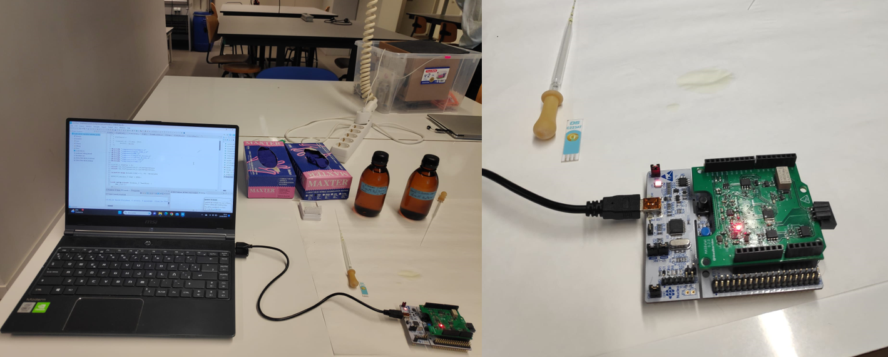

</br>

Los estudiantes Álvaro Leva Ligero y Guillermo Ruiz Carmona realizaron este proyecto como parte de su asignatura de Microcontroladores para Aplicaciones y Sistemas Biomédicos del Grado en Ingeniería Biomédica de la Universidad de Barcelona (UB).

El objetivo del proyecto era crear un algoritmo para un microcontrolador que pudiera **controlar y realizar ensayos químicos mediante un potenciostato** utilizando un conjunto de siete instrucciones y una interfaz gráfica de usuario desarrollada por LabView (viSens-S) para configurar diversos parámetros. Esta investigación consiste en medir varias soluciones químicas mediante cronoamperometría y voltamperometría cíclica.

### Tabla de contenidos

- [Introducción](#introducción)
   - [Potenciostato](#potenciostato)
   - [Cronoamperometría](#cronoamperometría)
   - [Voltamperometría cíclica](#voltamperometría-cíclica)
- [Objetivos](#objetivos)
- [Material y métodos](#material-y-métodos)
   - [STM32F401 Nucleo-64](#stm32f401-nucleo-64)
   - [STM32Cube IDE](#stm32cube-ide)
   - [Git y Github](#git-y-github)
   - [LabView](#labview)
   - [Módulos del front end](#módulos-del-front-end)
- [Flujos de Operaciones](#flujos-de-operaciones)
   - [FO aplicación](#fo-aplicación)
   - [FO Microcontrolador](#fo-microcontrolador)
   - [FO Voltamperometría cíclica](#fo-voltamperometría-cíclica)
   - [FO Cronoamperometría](#fo-cronoamperometría)
- [Resultados](#resultados)
- [Conclusiones](#conclusiones)


## Introducción

El sistema controlado por la interfaz gráfica de usuario de LabView permite utilizar un potenciostato para realizar **cronoamperometría y voltamperometría cíclica** mediante el ajuste de diversos parámetros.

Se ha diseñado una placa STM32F401 Nucleo-64 que permite realizar ensayos químicos para su posterior utilización en laboratorios mediante programación en C en el **entorno STM32Cube**. El eje central del proyecto es un microcontrolador capaz de recibir parámetros y transmitir los datos medidos a una interfaz gráfica que se muestra en la pantalla de un ordenador.

### Potenciostato

Se trata de un dispositivo para gestionar una célula de voltamperometría cíclica de tres electrodos utilizada para analizar analitos electroquímicamente.

Los pines frontales del potenciostato, que se comunican con el microcontrolador, son los siguientes:

| Pin | Alias | Tipo | Descripción |
| :-: | :---: | :------------------: | :-------------------------------------------------------------------------------------------------------------- |
| PA0 | VREF | Entrada analógica | Tensión absoluta del _Reference Electrode (RE)_ V<sub>REF</sub> utilizada para la medición de V<sub>CELL</sub>. |
| PA1 | ICELL | Entrada analógica | Tensión de salida del TIA utilizada para la medición de I<sub>CELL</sub>. |
| PB8 | SCK | I<sup>2</sup>C (SCK) | Señal SCK del I<sup>2</sup>C. Con el bus I<sup>2</sup>C e controla el DAC del _front-end_. |
| PB9 | SDA | I<sup>2</sup>C (SDA) | SDA signal from the I<sup>2</sup>C. Con el bus I<sup>2</sup>C e controla el DAC del _front-end_. |
| PA5 | EN | Salida digital | Señal de (des)habilitación de la PMU.<br>`0`: PMU deshabilitada. `1`: PMU habilitada. |
| PB5 | RELAYS | Salida digital | Señal de control del relé.<br>`0`: Relé abierto. `1`: Relé cerrado. |

> Tabla con los pines de las [directrices](https://github.com/Biomedical-Electronics/masbstat-arlevino_grc32)del proyecto.

### Cronoamperometría

**[Cronoamperometría](https://en.wikipedia.org/wiki/Chronoamperometry)** utiliza un electrodo excitado por un potencial de tensión y es capaz de monitorizar las reacciones electroquímicas que tienen lugar en este electrodo como una corriente dependiente del tiempo.

<p align='center'>

</p>

<p align="center">
<i> Fig.1 - Gráfico de ejemplo de cronoamperometría . </i>
</p>

> [referencia de la figura](https://en.wikipedia.org/wiki/Chronoamperometry)

La difusión del analito a través de la superficie del sensor afecta al modo en que la [corriente cambia con el tiempo](https://pubs.acs.org/doi/abs/10.1021/jp711936y). La concentración desempeña un papel fundamental a la hora de considerar los valores obtenidos.

### Voltamperometría cíclica

En una [voltamperometría cíclica](https://en.wikipedia.org/wiki/Cyclic_voltammetry), el potencial en el *electrodo de trabajo* cambia linealmente con el tiempo hasta un valor determinado, repitiendo este proceso múltiples ciclos. Finalmente, se produce un gráfico cíclico trazando la corriente del electrodo en función del potencial aplicado.

<p align='center'>

</p>

<p align="center">
<i> Fig.2 - Gráfico de ejemplo de voltamperometría cíclica . </i>
</p>

> [referencia de la figura](https://en.wikipedia.org/wiki/Cyclic_voltammetry)

Esta prueba se realiza para examinar las *propiedades electroquímicas* del analito cuando está en contacto con el electrodo.

Mide la señal con un total de tres electrodos, de forma similar a otros métodos de voltamperometría:

- **Electrodo de referencia**: Sirve para fijar la referencia del electrodo de trabajo durante la medida de potencial. Ya tiene potencial.
- **Electrodo de trabajo**: Responsable de la medida de la señal.
- **Electrodo contador**: Sirve para medir la corriente del electrodo de trabajo.

El equilibrio entre los analitos oxidados (Ox) y reducidos (Red) se describe mediante la [ecuación de Nernst](https://pubs.acs.org/doi/10.1021/acs.jchemed.7b00361). La ecuación de Nernst relaciona el potencial de una célula electroquímica (E) con el potencial estándar de una especie (E<sup>0</sup>) y las actividades relativas del sistema en equilibrio. En la ecuación, F es la constante de Faraday, R es la constante universal de los gases, n es el número de electrones y T es la temperatura.

$$
E = E^{0}+\frac{RT}{nF}\ln{\frac{Ox}{Red}}
$$

La ecuación de Nernst permite predecir cómo responderá un sistema a un cambio de concentración de especies en la solución o a un cambio en el potencial del electrodo.


## Objetivos
El objetivo principal de este proyecto es desarrollar un potenciostato portátil. Para alcanzar esta meta final deben lograrse los siguientes objetivos secundarios:

Controlar la Unidad de Gestión de Potencia (PMU) del módulo front-end del potenciostato. 
Establecer comunicación con la aplicación viSens-S instalada en el host u ordenador utilizando el [protocolo MASB-COMM-S](https://github.com/Biomedical-Electronics/masbstat-arlevino_grc32/blob/master/Docs/protocolo-de-comunicacion.md).
Realizar una voltamperometría cíclica y una cronoamperometría.
Realizar un proyecto cooperativo de software utilizando las funcionalidades de Git para desarrollar los diferentes módulos del producto final proporcionando feedback constante al equipo.

## Material y métodos
En las líneas siguientes se describen los materiales y métodos empleados para la ejecución del proyecto.

### STM32F401 Nucleo-64
La [STM32F401 Nucleo-64](https://www.st.com/en/evaluation-tools/nucleo-f401re.html) placa es una EVB asequible y flexible adecuada para la creación de prototipos. Ofrece conectividad Arduino y cuenta con su depurador integrado y librerías de software gratuitas.  Esto, junto con la amplia oferta de IDEs, la convierte en una solución completa y rentable para desarrollar y probar aplicaciones.


<p align="center">

</p>

<p align="center">
<i> Fig.3 - STM32 Nucleo-64 tabla de evaluación . </i>
</p>


> [referencia de la figura](https://www.st.com/en/evaluation-tools/nucleo-f401re.html)


  
### STM32Cube IDE

STM32Cube IDE es un entorno de desarrollo integrado (IDE) diseñado específicamente para programar y desarrollar aplicaciones para microcontroladores STM32. Proporciona una amplia gama de herramientas, funciones y recursos para facilitar el proceso de desarrollo. Las librerías HAL (Capa de abstracción de hardware), por ejemplo, contienen varias funciones implementadas con un mayor nivel de abstracción que permiten una codificación eficiente y son valiosas para este proyecto.

<p align="center">

</p>

<p align="center">
<i> Fig.4 - Software integrado proporcionado por STM32Cube IDE para una programación versátil. </i>
</p>

> [referencia de la figura](https://www.st.com/content/ccc/resource/sales_and_marketing/presentation/product_presentation/37/55/ff/bc/a8/71/4f/c5/stm32_embedded_software_offering.pdf/files/stm32_embedded_software_offering.pdf/jcr:content/translations/en.stm32_embedded_software_offering.pdf)

Además, aprovecharemos [STM32CubeMX](https://www.st.com/en/development-tools/stm32cubemx.html), que es una herramienta gráfica que facilita la configuración de los periféricos del microcontrolador.

### Git y Github

Para desarrollar de forma cooperativa los diferentes módulos generando diferentes versiones de código de forma estructurada y sistemática se han utilizado Git y Github. De esta forma, el proyecto global se ha desglosado en paquetes de trabajo que se han realizado por separado entre los miembros del equipo para llegar al entregable final y único.


* **Git - Software de control de versiones (SCV)**

[Git](https://git-scm.com/) es un **software de control de versiones** de código abierto. Se utiliza principalmente para el desarrollo colaborativo de software, como herramienta que permite el control simultáneo de versiones de código ayudando así a monitorizar el flujo de trabajo de un proyecto de programación.

* **GitHub - Plataforma de desarrollo de software**
 
[GitHub](https://github.com/about) es una empresa que ofrece un servicio de alojamiento en Internet que utiliza Git para facilitar el desarrollo colaborativo de software y el control de versiones. Permite guardar la trazabilidad de Git en un servidor remoto [[1]](https://en.wikipedia.org/wiki/GitHub). 


Utilizando ambas herramientas, la ejecución del proyecto se ha basado en 3 ramas principales:

* **master:** Rama que contiene el código de producción. Entregable final para el cliente.

* **develop:** Rama que contiene el trabajo de desarrollo. En esta rama se agrupan y prueban los desarrollos de todos los miembros del equipo. Una vez validado su correcto funcionamiento, el contenido de la rama develop se fusiona en la rama master mediante un Pull Request, para ser entregado al cliente.

* **feature/<descriptive_name>:** Rama que contiene el desarrollo individual o colectivo de una funcionalidad. El contenido de esta rama se fusiona con la rama de desarrollo mediante una solicitud de extracción, una vez que se ha probado.


> Diagrama del flujo de trabajo Git con las diferentes ramas. La cantidad de *commits* está fijada en 3 a efectos ilustrativos, algunas ramas tienen menos pero la mayoría tienen más.

### LabView
[LabView](https://www.ni.com/es-es/shop/labview.html#pinned-nav-section2) es un entorno gráfico de programación que, entre otras funcionalidades, permite generar interfaces de usuario interactivas para controlar sistemas e instrumentación. En nuestro caso es especialmente útil para generar la interfaz de control del potenciostato. A través de la aplicación [viSens-S](https://github.com/Albert-Alvarez/viSens-S/releases/tag/v0.2.1), desarrollado en LabView, podremos comunicarnos con el microcontrolador para ejecutar y visualizar las diferentes pruebas con los parámetros deseados.

### Módulos del front end
A continuación se describen los distintos módulos del front-end controlados por el microcontrolador STM.

* **Unidad de gestión de energía (PMU)** 
Este módulo garantiza la alimentación de todos los elementos del front-end. Para evitar el gasto innecesario de energía, está en estado desactivado por defecto. Se activará a través del pin ``EN`` con la inicialización del programa del microcontrolador.

* **Relé**
Cierra el circuito entre el front-end y el sensor electroquímico cada vez que hay que tomar una medida.

* **Potenciostato**
El potenciostato **polariza la célula electroquímica** a una tensión V<sub>CELL</sub> y lee la corriente que circula por I<sub>CELL</sub>.

Para establecer V<sub>CELL</sub> se utiliza un convertidor de digital a analógico (DAC) MCP4725 con dirección I<sup>2</sup>C ``1100000``. El DAC puede generar una tensión de salida en un rango de 0 a 4V. Sin embargo, para permitir la polarización negativa, se añade un sistema para transformar la salida unipolar en bipolar; de -4 a 4V.

Aunque tengamos control sobre la tensión de polarización de la célula, no podemos darla por sabida. Por eso empleamos el ADC del microcontrolador para leer un voltaje llamado V<sub>ADC</sub>, que representa la tensión del electrodo de referencia (V<sub>REF</sub>) después de pasar por un circuito convertidor de señal bipolar a unipolar. A partir de esta tensión VREF, podemos determinar la tensión de la célula (V<sub>CELL</sub>). Para medir la corriente que pasa por la célula, utilizamos un amplificador de transimpedancia (TIA). El TIA tiene una resistencia de 50 kΩ. La señal también se convierte de bipolar a unipolar mediante un conversor de señal.
En el proyecto ya está disponible una biblioteca llamada ``formulas`` para permitir la conversión entre las medidas del ADC a los niveles de tensión/corriente pertinentes.
 
## Flujos de Operaciones
En esta sección se describen los flujos de trabajo de ejecución en diferentes niveles de abstracción.

### FO aplicación
La aplicación consta de una interfaz de usuario principal en la que se pueden configurar los parámetros y el modo de medida para enviarlos al microcontrolador y recibir las medidas de cada punto para representarlas en la ventana gráfica.
 ```mermaid
  graph TD
    A[Usuario] -.-> B(Iniciación viSens-S)
    B --> C(Conectar dispositivo)
    C --> D(Indicar la prueba a realizar)
    D --> E(Establecer parámetros)
    E --> F(Iniciar medición)
    F --> P
    P --> G(Iniciar medición)
    F --> K(Recivir medición)
    K --> L(Mostrar medida en gráfico y tabla)
    L --> M{Última medición?}
    M --> |Sí|N(Fin de la aplicación)
    M --> |No|D
    G --> |Enviar parámetros|I

    H[Microcontrolador] --> I(Recibir parámetros)
    I --> J(Tomar medidas)
    J --> Q(Enviar datos)
    Q --> K
    Q --> R(Fin de la medición)

    O[Device] -......->P(Establecer medición)
```


### FO Microcontrolador
En función del mensaje recibido, el microcontrolador debe procesar y activar varias funciones. El flujo de trabajo del microcontrolador se representa en el diagrama siguiente.


Antes de recibir una instrucción, se configuran los periféricos y se inician las distintas variables del microcontrolador. Hay cuatro tipos diferentes de instrucciones que se pueden dar:

* **Cronoamperometría**: si recibe `START_CA_MEAS` guarda la configuración de la Cronoamperometría y cambia la variable de estado a CA. La Cronoamperometría sólo tendrá lugar cuando el estado de la variable sea CA.
* **Voltamperometría cíclica**: si recibe `START_CV_MEAS`, guarda la configuración de la Voltamperometría cíclica y cambia la variable de estado a CV. La voltamperometría cíclica sólo tendrá lugar cuando el estado de la variable sea CV.
* **Stop**: si recibe `STOP_MEAS`, procede a detener cualquier función que esté realizando y cambia el estado a IDLE.
* **Por defecto**: si no se recibe ninguna de las anteriores, el microcontrolador esperará una nueva instrucción en lugar de realizar ninguna acción.


### FO Voltamperometría cíclica
Se han implementado dos funciones, para inicializar la prueba de voltamperometría cíclica ``CV_init`` y otra para calcular cada punto de medida ``make_CV``.

* ``CV_init``: conduce el flujo de trabajo desde el inicio hasta la inicialización del temporizador.
* ``make_CV``: conduce el flujo de trabajo desde la condición "Ha transcurrido el periodo de muestreo?" hasta el final.


### FO Cronoamperometría
Se han implementado dos funciones, para inicializar la prueba de cronoamperometría ``CA_init`` y otra para calcular cada punto de medida ``make_CA``.

* ``CA_init``: conduce el flujo de trabajo desde el inicio hasta la inicialización del temporizador.
* ``make_CA``: conduce el flujo de trabajo desde la condición "Ha transcurrido el tiempo de medición?" hasta el final.


## Resultados
Para probar el rendimiento del potenciostato final se utilizó una solución de K3[Fe(CN)]<sub>-6</sub>, que se depositó en un electrodo serigrafiado conectado al microcontrolador. El montaje utilizado puede verse en la figura siguiente.

<p align="center">

</p>
<p align="center">
<i> Fig.5 - Prueba final del potenciostato. </i>
</p>

Desgraciadamente, los valores de las medidas electroquímicas no fueron los esperados. Tanto en las pruebas de cronoamperometría como en las de voltamperometría cíclica, la temporización del sistema funcionó correctamente (frecuencia de muestreo, ciclos, tiempo de medición). Sin embargo, los valores mostrados en la interfaz gráfica no eran coherentes, mostrando oscilaciones inesperadas. No se pudo realizar la voltamperometría cíclica y, en consecuencia, tampoco la cronoamperometría.

<p align="center">

</p>
<p align="center">
<i> Fig.6 - Resultados de la cronoamperometría. </i>
</p>

En la figura puede verse cómo el primer punto rara vez aparecía alejado del resto de las mediciones. Las flechas indican la duración prevista de 10s.

## Conclusiones
Volviendo a los objetivos iniciales, la ejecución del proyecto ha seguido con éxito la pauta establecida en cuanto al desarrollo cooperativo del programa del potenciostato utilizando tanto Git como GitHub. Sin embargo, uno de los objetivos principales consistente en realizar una cronoamperometría y una voltamperometría cíclica no pudo ser alcanzado. Tras comprobar exhaustivamente el código, los miembros del equipo no pudieron encontrar el error causante de los resultados incorrectos. Tras realizar las simulaciones con viSens-S, el error aparentemente no afecta a la temporización de las pruebas, siendo coherente con el periodo de muestreo, el número de ciclos y el tiempo de medición dados. En cambio, el error parece estar en la interpretación de los valores de medición.<br>s
Al fin y al cabo, el proyecto ha proporcionado a los desarrolladores conocimientos sobre generación de software cooperativo, programación de microcontroladores, uso de librerías específicas y buena praxis a la hora de desarrollar cada uno de los módulos. Sin embargo, sería necesario seguir trabajando para corregir el error que causa los resultados finales incoherentes.
